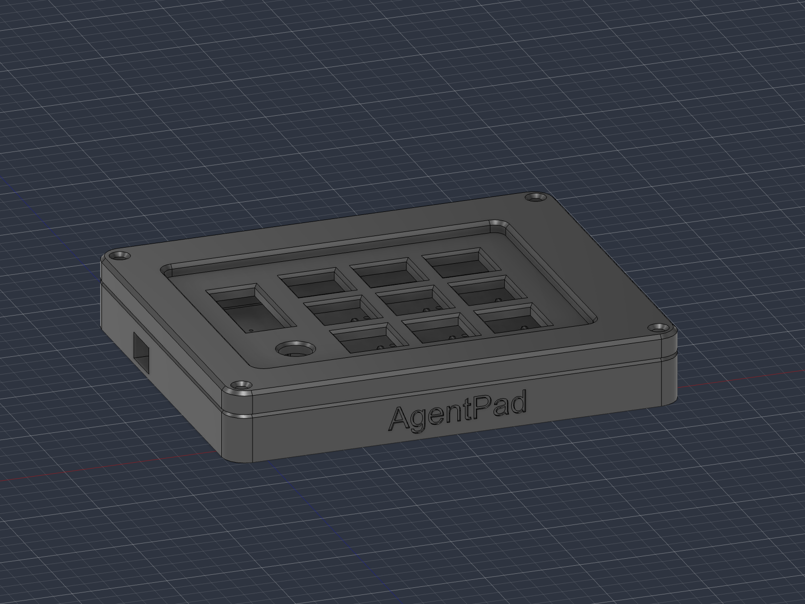
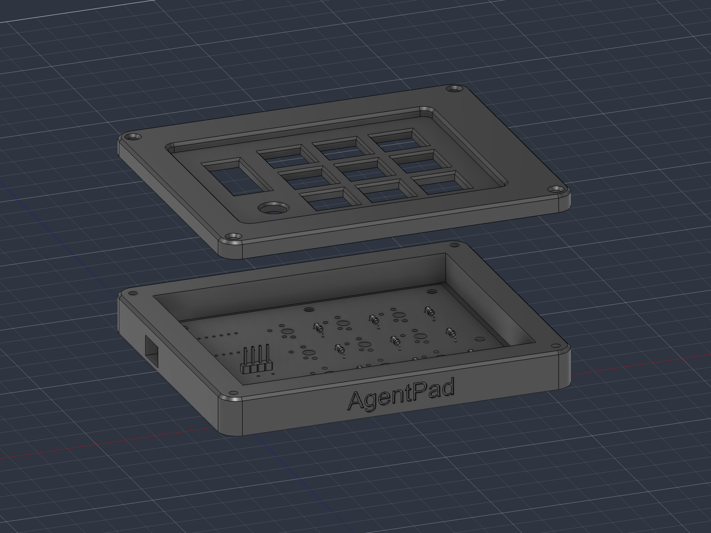
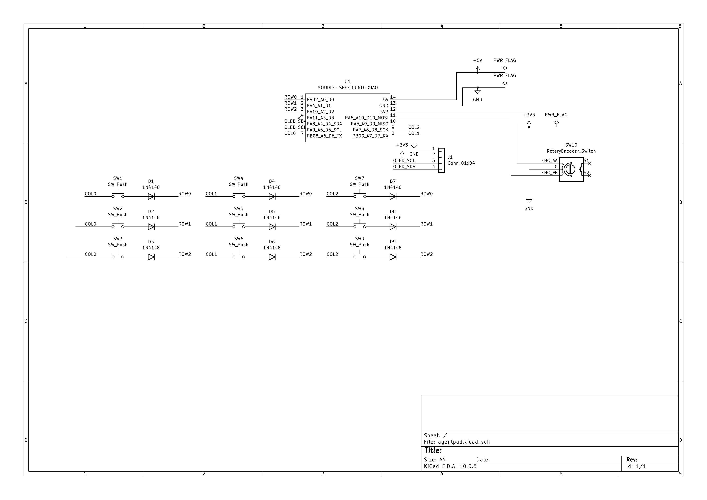
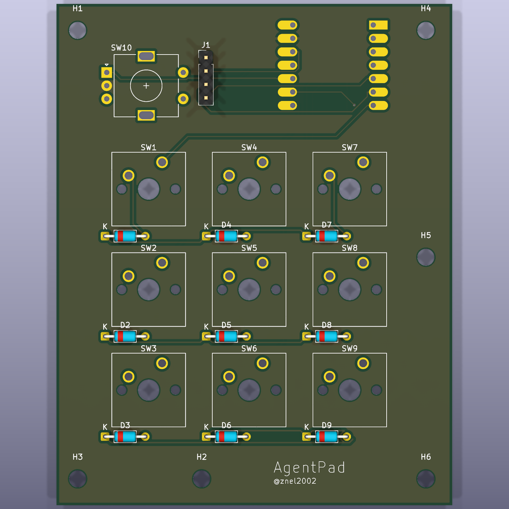

# AgentPad

A 9-key macropad + rotary encoder + OLED for driving **AI coding agents** — Claude Code, Codex CLI, and Cursor. Firmware-native (no host daemon), vendor-neutral, with a per-tool **LAYER** key instead of app-detection. Built for **Hack Club Hackpad**.



## What it does

Nine keys mapped to the actions you hit dozens of times an hour when driving an agent, plus a rotary dial and a status screen:

| | | |
|---|---|---|
| **STOP** (interrupt) | **YES** (approve) | **NO** (reject) |
| **PLAN** (mode toggle) | **NEW** (`/clear`) | **TALK** (push-to-talk) |
| **RUN** (test/last cmd) | **COMPACT** (`/compact`) | **LAYER** (switch tool) |

- **Encoder** — turn = model / reasoning-effort dial.
- **OLED** — shows the active tool profile + mode.
- **LAYER key** — cycles per-tool keymaps: **Claude Code → Codex → Cursor → shell**. Each key sends that tool's real shortcut; hold-LAYER reaches secondary actions (accept-edit, reject-edit, resume, background). No daemon, no app-detection.

Full keymap + pin map: [docs/DESIGN-SPEC.md](docs/DESIGN-SPEC.md). Keymap logic is unit-tested: [Firmware/tests/sim_keymap.py](Firmware/tests/sim_keymap.py).

## Hardware

- **MCU:** Seeed XIAO RP2040 (all 11 GPIO used)
- **Keys:** 9× MX in a 3×3 diode matrix (9× 1N4148, COL2ROW)
- **Encoder:** 1× EC11 (turn-only)
- **Display:** 1× 0.91" SSD1306 OLED (I2C)
- **Firmware:** KMK (CircuitPython)
- **RGB:** deferred to v2 (v1 ships without LEDs)

## Renders & proof

**Exploded — top plate / PCB / bottom tray**


**Schematic**


**PCB — DRC passes with 0 errors**


## Bill of Materials

All parts come from the free Hackpad kit (nothing self-sourced):

| Part | Qty | Notes |
|---|---|---|
| Seeed XIAO RP2040 | 1 | microcontroller |
| 1N4148 diode | 9 | switch matrix, COL2ROW, `D_DO-35_SOD27_P7.62mm` |
| MX-style switch | 9 | solder-in, 3×3 grid @ 19.05 mm |
| EC11 rotary encoder | 1 | model / effort dial |
| 0.91" OLED (SSD1306) | 1 | I2C, pin order GND-VCC-SCL-SDA |
| DSA blank keycap | 9 | color/legend via a printed card |
| M3 screw | 4 | lid → base corner posts |

## Repo structure

```
CAD/         agentpad-case.f3d (Fusion source), agentpad_assembly.step/.3mf (case + real PCB), board STEP
PCB/         KiCad project — schematic, board (DRC 0 errors), Hack Club care-package libs
Firmware/    KMK source (kmk/main.py) + keymap simulation test
production/  gerbers.zip, top_plate.stl, bottom_tray.stl, main.py
docs/        DESIGN-SPEC, BUILD-PLAN, screenshots
```

## Firmware (KMK)

Flash CircuitPython to the XIAO, copy the KMK `kmk/` folder + libs + [`Firmware/kmk/main.py`](Firmware/kmk/main.py) to the `CIRCUITPY` drive. Details + per-layer keystroke tables: [Firmware/README.md](Firmware/README.md).

## Case

3D-printed two-part sandwich — **top lid + bottom base** — designed in **Autodesk Fusion** ([CAD/agentpad-case.f3d](CAD/agentpad-case.f3d)) around the exact PCB (imported as STEP). Both parts print flat with no supports.

- **Lid:** recessed key well inside a raised bezel; 9 switch cutouts with chamfered mouths, an encoder hole, and an OLED window; rounded R6 corners.
- **Base:** holds the PCB on corner posts; USB-C exits a slot in the side wall; **AgentPad** engraved on the front wall; matching R6 corners and chamfered top edge.
- **Assembly:** 4× M3 screws through the lid into the base's corner posts.

Fit is verified against the real board geometry — switch cutouts sit exactly on the switch stems, and screw holes align to the base bosses.

## License

MIT — see notes; the vendored Hack Club care package under `PCB/lib/` retains its own license.
